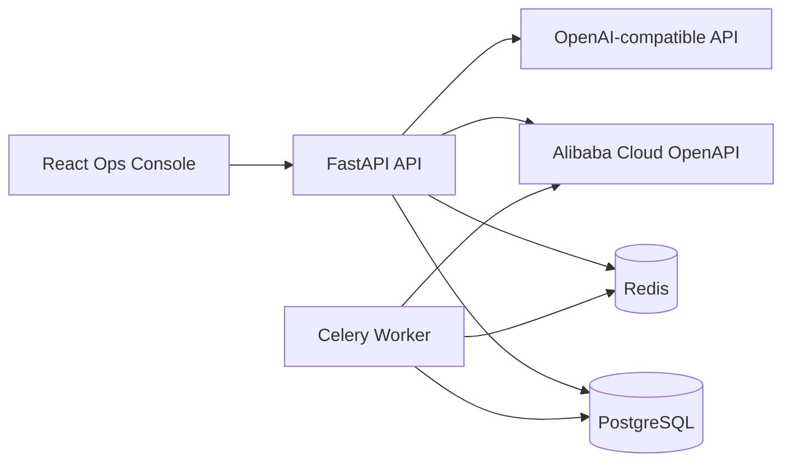

# Local AI Ops

一个面向局域网和本机部署的阿里云 AI 运维工作台。项目通过阿里云 OpenAPI 同步 ECS、轻量应用服务器、OSS、域名和 DNS 等资源，在本地保存运维资料，执行 HTTP/TCP/SSH/云助手检查，并基于告警上下文生成 AI 排查建议。

> 当前版本定位为 MVP。它适合个人或小团队在可信局域网内统一查看资源、续费、入口、SSH/宝塔资料和监控结果，不建议直接暴露到公网。

## Features

- 云账号接入：保存 RAM AccessKey，测试 STS、Resource Center、ECS、OSS、Domain、DNS、CloudMonitor、Cloud Assistant 和 BSS 续费查询能力。
- 资产同步：同步 ECS、轻量应用服务器、OSS、域名、DNS，并按类型、状态、地域分页展示。
- 运维资料：本地维护到期时间、自动续费、业务入口、控制台入口、SSH 凭据、宝塔面板入口和账号资料。
- 监控检查：支持 HTTP 探活、TCP 端口、SSH 登录、ECS 指标、Cloud Assistant 只读命令。
- 告警闭环：按连续失败次数产生告警，支持确认、关闭和恢复状态。
- AI 诊断：支持 OpenAI-compatible API，基于资产、告警、最近检查结果生成排查步骤和建议命令。
- 本地安全：AccessKey、SSH 密码、私钥、宝塔密码和 AI Key 使用 AES-GCM 加密保存，页面只显示脱敏结果。
- 局域网使用：前端和 API 可在同一局域网访问，PostgreSQL 和 Redis 默认仅在 Docker 网络内部通信。

## Tech Stack

- Backend: FastAPI, SQLAlchemy 2, Alembic, PostgreSQL, Redis, Celery
- Frontend: React, Vite, TypeScript, ECharts, lucide-react
- Cloud: Alibaba Cloud SDK / OpenAPI
- AI: OpenAI-compatible Chat Completions API
- Runtime: Docker Compose

## Architecture



## Quick Start

### 1. Clone

```bash
git clone https://github.com/linsk27/local-ai-ops.git
cd local-ai-ops
```

### 2. Configure

```bash
cp .env.example .env
```

生成一个稳定的本地加密主密钥：

```bash
python -c "import base64, os; print(base64.urlsafe_b64encode(os.urandom(32)).decode())"
```

写入 `.env`：

```env
MASTER_KEY=your-generated-master-key
ALIYUN_MODE=real
ALIYUN_DEFAULT_REGION=cn-hangzhou
AUTH_ENABLED=true
ADMIN_USERNAME=admin
ADMIN_PASSWORD=change-me-now
AUTO_SYNC_ENABLED=false
```

首次启动后用 `ADMIN_USERNAME` / `ADMIN_PASSWORD` 登录。请把默认密码 `change-me-now` 改成自己的强密码；页面会在默认密码未修改时显示安全提示。

### 3. Run

```bash
docker compose up --build
```

默认地址：

- Frontend: [http://localhost:5173](http://localhost:5173)
- API Docs: [http://localhost:8000/docs](http://localhost:8000/docs)
- Health: [http://localhost:8000/health](http://localhost:8000/health)

登录后，右上角刷新只读取本地数据库，不会重新调用阿里云。需要重新拉取云资源时，到“云账号”页点击“同步资产”。

## Local Development

Backend:

```powershell
cd backend
python -m venv .venv
.\.venv\Scripts\Activate.ps1
pip install -r requirements.txt
uvicorn app.main:app --reload --port 8000
```

Frontend:

```powershell
cd frontend
npm install
npm run dev
```

Worker:

```powershell
cd backend
celery -A app.worker.celery_app worker --loglevel=info --pool=solo
```

Tests:

```powershell
cd backend
pytest

cd ..\frontend
npm run build
```

## LAN Mode

如果需要让局域网内其他设备访问：

1. 找到运行机器的局域网 IP，例如 `192.168.1.20`。
2. 访问 `http://192.168.1.20:5173`。
3. 前端会自动调用同一主机的 `http://192.168.1.20:8000/api`。

默认只暴露前端 `5173` 和后端 `8000`。PostgreSQL 和 Redis 不暴露到主机端口。

## Alibaba Cloud Setup

请使用 RAM 用户，不要使用阿里云主账号 AccessKey。建议只授权只读和必要的云助手只读命令能力：

- STS: `GetCallerIdentity`
- Resource Center: resource search / list
- ECS: describe regions, instances, disks, network and monitor related read APIs
- SWAS: simple application server read APIs
- OSS: list buckets and bucket info read APIs
- Domain / AliDNS: domain and DNS record read APIs
- CloudMonitor: metric read APIs
- Cloud Assistant: execute approved read-only commands
- BSS OpenAPI: query available instances / renewal status

`ALIYUN_DEFAULT_REGION` 只用于 SDK 初始化和兜底查询。资产同步会自动扫描账号可访问的 ECS 地域，不要求所有服务器都在同一个地域。

## Monitoring Types

- HTTP 探活：检查网站或接口是否返回可用状态。
- TCP 端口：检查端口是否能建立连接，例如 `8.8.8.8:80`。
- SSH 连通：验证服务器 SSH 凭据是否可登录。
- ECS 指标：从 CloudMonitor 获取 CPU、网络、磁盘 IO 等云监控指标。
- 云助手只读命令：通过 Cloud Assistant 执行白名单命令，例如 `free -m`、`df -h`。

云助手和 SSH 采集到的内存、磁盘使用率会写回资产列表。未配置凭据、命令失败或实例不支持云助手时，列表会显示未采集。资产详情页的“生成默认监控”会幂等创建常用检查项：服务器会创建 SSH/TCP 22、`df -h`、`free -m`，域名会创建 HTTPS 探活，OSS 会创建 bucket endpoint 检查。

## AI Config

AI 配置支持 OpenAI-compatible API：

- Base URL，例如 `https://api.openai.com/v1`
- API Key
- Model，例如 `gpt-4.1-mini` 或兼容服务提供的模型名

AI Key 会加密保存。AI 诊断只生成摘要、可能原因、排查步骤和建议命令，不会自动执行修复。

## Security Notes

- `.env`、本地数据库、日志、虚拟环境、构建产物和依赖目录不会进入 Git。
- 敏感字段使用 AES-GCM 加密保存。
- 默认启用单管理员本地登录；除 `/health` 和 `/api/auth/login` 外，API 默认需要 Bearer token。
- API 响应、日志和 AI prompt 会经过脱敏处理。
- SSH 密码、私钥、宝塔密码只在用户主动复制时解密返回。
- 本项目不是公网多租户系统，不适合直接公网部署。

## Repository Layout

```text
.
├── backend/              # FastAPI API, models, services, worker and tests
├── frontend/             # React/Vite operations console
├── docker-compose.yml    # Local stack: API, worker, frontend, Postgres, Redis
├── .env.example          # Safe configuration template
├── README.md
├── CHANGELOG.md
└── LICENSE
```

## FAQ

### 右上角刷新会重新同步阿里云吗？

不会暴力全量同步。刷新主要重新读取本地 API 数据，并优先执行轻量的页面数据刷新。阿里云资产同步请在云账号页点击同步资产，避免频繁调用云 API。

### 阿里云 API 会额外收费吗？

普通查询类 OpenAPI 通常不按调用单独收费，但云资源本身、流量、监控高级能力或第三方服务可能有费用。项目会尽量减少无意义同步，但仍建议不要高频全量刷新。

### 为什么内存和磁盘显示未采集？

规格信息来自云资产接口，使用率来自服务器内部采集。需要满足以下条件之一：

- Cloud Assistant 可用，并允许执行白名单只读命令。
- 或者在资产详情页配置 SSH 用户名、端口、密码或私钥。

配置后执行“采集使用率”或对应监控项，成功结果会写回资产列表。

### 第一次怎么配置 SSH 密码？

如果忘记服务器系统密码，需要先在阿里云 ECS/轻量服务器控制台重置实例登录密码，按提示重启实例。已经能进入服务器终端时，可以执行 `passwd root` 修改 root 密码，并用 `ss -lntp | grep ':22'` 确认 SSH 端口监听。然后回到资产详情页，选择 SSH 密码，填写公网 IP、端口 `22`、登录用户（通常是 `root`）和刚设置的系统密码。这里不是宝塔面板密码。

### 宝塔面板账号密码会自动获取吗？

不会。宝塔面板账号和密码不属于阿里云资源接口返回内容，需要用户在本地手动保存。项目可以加密保存、复制和打开面板入口，但不会自动登录。

## Roadmap

- 本地知识库和 AI 问答
- 批量服务器凭据管理
- 更完整的费用和续费视图
- 监控任务运行日志
- 多用户登录和操作审计增强
